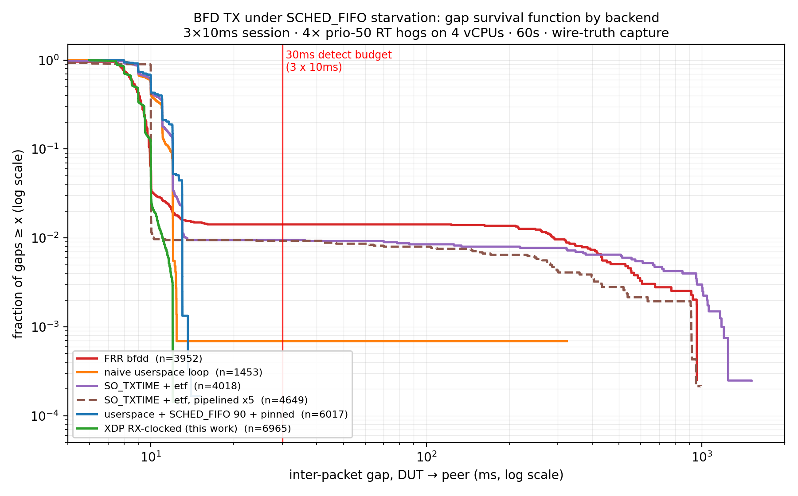

# Line-card BFD for plain Linux: an XDP fast path vs userspace scheduling

*All code, packet captures, and analysis: https://github.com/w453y/xdp-bfd*

## 1. The problem

BFD is the failure detector under BGP, OSPF, and IS-IS: two routers exchange small UDP packets at a negotiated interval, and if one side misses enough of them (typically 3 packets in 30ms at aggressive timers) it declares the link dead and the routing protocol withdraws routes. The entire value of the protocol is timing. A BFD implementation that sends late is worse than no BFD at all, because a false timeout tears down routes for a link that's actually fine. The failure detector becomes the failure.

The operational folklore says software BFD can't be trusted with aggressive timers under CPU load. It's why people configure 3x300ms instead of 3x10ms, why SONiC's software BFD documentation caps timers at 300ms, and why hardware routers offload BFD to line cards. Juniper goes as far as dedicating an offload CPU with DPDK flow filters on the vSRX, which is a vendor telling you the forwarding plane can't be trusted to deliver BFD packets to a busy control plane on time.

I wanted three things: to quantify the actual failure modes instead of repeating the folklore, to understand why userspace BFD fails when it fails, and to see whether plain Linux on a commodity NIC can get line-card behavior using XDP. This is a lab project, a few weeks of evenings on a Proxmox testbed, but every claim in it is backed by a packet capture in the repo.

## 2. Measuring the folklore

The testbed is three Ubuntu 26.04 VMs (kernel 7.0, virtio-net with multiqueue) on an isolated Proxmox bridge: a device under test, an FRR peer, and a load generator that ended up mostly unused because the interesting load is on the DUT itself. The measurement instrument is tcpdump on the hypervisor bridge. The host sees actual wire times and doesn't care what the guest's processes believe. That choice turned out to matter more than expected; section 3 has a concrete example of process logs and the wire disagreeing completely.

Baseline: FRR 10.5.1's bfdd, a single-hop session at 3x10ms (30ms detect time), and an escalating stress-ng ladder on the DUT. Gaps are DUT-to-peer inter-packet times from the host capture; nominal spacing with RFC jitter is 7.5-10ms.

| Level | Load | p50 | p99 | max gap | session |
|---|---|---|---|---|---|
| L1 | 4x CPU hogs (fair sched) | 8.81 | 10.03 | ~10ms | survived |
| L2 | 8x CPU + context-switch/yield churn | 8.73 | 10.03 | 750ms | flapped |
| L3 | CPU + timer/timerfd/hrtimer pressure | 8.82 | 10.16 | 970ms | 44 flaps in 120s |
| L4 | 4x SCHED_FIFO prio-50 hogs | 8.82 | 287 | 960ms | flapped hard, ~40% of packets never sent |

The number that should worry anyone running BFD in production is not the 970ms. It's the p99 sitting at 10.16ms in the same run. The starvation events that kill sessions are rare, a handful per hundred seconds, so they're invisible to percentile monitoring. A dashboard graphing p99 packet spacing on that box would have shown a perfectly healthy BFD daemon while it flapped 44 times. If your alerting is percentile-based, you find out about this class of failure from the routing protocol, after the withdrawal.

## 3. First surprise: the folklore is (partly) wrong

Before writing any kernel code I wanted a second data point on the "userspace BFD can't hold aggressive timers" claim, so I wrote the dumbest possible BFD daemon: 160 lines, one thread, a recv() with a 2ms timeout as the main loop clock, RFC 5880 state machine, nothing else. The plan was to watch it die the same way bfdd did and then be justified in building the XDP path.

It didn't die. Under the exact timer/hrtimer stress that flapped bfdd 44 times in 120 seconds, the naive loop ran clean: 0 flaps, p99 gap 13ms against a 30ms budget. I ran it twice because I didn't believe it.

The explanation is scheduler mechanics, not luck. A task that wakes 500 times a second, does microseconds of work, and sleeps again accumulates almost no vruntime, so whenever it wakes, CFS considers it the most deserving thing on the runqueue and it preempts the CPU hogs nearly instantly. bfdd is the opposite shape: a heavyweight event loop serving zebra IPC, config machinery, and many timers, waking on exact intervals. The timer-subsystem stress was hitting precisely its wakeup path. "Userspace" was never the problem as a category; the architecture of the wakeup path was.

So the folklore needed rewriting: userspace BFD reliability depends on winning a scheduling war, and your event-loop architecture decides how well-armed you are. Which raises the obvious next question: is there a war no userspace architecture wins?

Yes: SCHED_FIFO. Four real-time priority hogs on four vCPUs, and the naive loop finally broke: 25 flaps in 60 seconds, max TX gap 324ms. The kernel's RT throttling reserves about 50ms per second for normal tasks when RT work saturates the CPUs; no amount of CFS-friendliness helps when you only exist for one breath per second. This matters because it's not an artificial condition: on a loaded router, packet forwarding, softirq storms, and other RT-priority work outranking a BFD daemon is the normal state of affairs, not the exception.

The failure had one more lesson in it. During the RT runs, the naive daemon's own log showed zero detect timeouts. From its perspective, the peer's packets kept arriving on schedule. They hadn't. They'd been queueing in the socket buffer while the daemon was starved; when it finally got CPU, it drained the backlog and its state machine saw a smooth stream of "arrivals." The peer, watching the actual wire, saw 300ms of silence and correctly declared the session dead. Process logs lie under exactly the conditions you most need them; this is why every number in this writeup comes from tcpdump on the hypervisor bridge instead.

## 4. The TX bake-off

At this point the question had sharpened from "userspace vs kernel" to "which transmit architectures survive RT starvation, and at what cost." I tested five under identical conditions: 4x SCHED_FIFO prio-50 hogs, 60 seconds, the 3x10ms session, wire-truth capture:

| TX backend | flaps | p50 | p99 | max gap |
|---|---|---|---|---|
| FRR bfdd | continuous | 8.8 | 287 | 960ms |
| naive userspace loop | 25 | 10.0 | 12.0 | 324ms |
| userspace + chrt -f 90 + pinned core | 0 | 10.0 | 13.0 | 15.0ms |
| SO_TXTIME + etf qdisc, one packet in flight | 48 | 10.0 | 13.2 | 1517ms |
| SO_TXTIME + etf qdisc, pipelined 5 deep | 48 | 10.0 | 10.1 | 994ms |
| XDP RX-clocked (section 5) | 0 | 8.75 | 11.0 | 12.5ms |

The chrt row is the classic mitigation and it works completely, with an asterisk. Running the daemon at RT priority 90 above the prio-50 hogs means you won the priority war. On a real router you can't assume you'll win it: forwarding work, softirq processing, and other components are fighting for the same priorities, and a priority arms-race between your failure detector and your data plane is not a design, it's a standoff.

The etf rows are the most instructive failure of the project. The theory was attractive: SO_TXTIME lets userspace enqueue a packet with an explicit future launch time, and the etf qdisc releases it at that nanosecond via hrtimer, so wire timing becomes independent of when userspace got scheduled. And it delivers on that promise: the pipelined variant produced the best p99 of every backend tested (10.1ms). It also flapped 48 times, worse than doing nothing special at all.

Zero packets were dropped by the qdisc in those runs. etf did its job perfectly on every packet it was given. The problem is that a starved daemon gives it nothing. Timestamping fixes jitter; it cannot manufacture liveness. Pipelining five packets ahead buys 50ms of starvation tolerance, but the failure signature in the gap data, max gaps clustering at 915-995ms, is the RT throttle's breathing pattern: userspace gets its ~50ms of CPU once per second, and a 50ms pipeline against a 950ms drought loses every time. Deepening the pipeline doesn't fix it either, because pre-built packets carry pre-built protocol state; a pipeline deep enough to bridge the drought is a second of frozen, potentially stale announcements. etf's tolerance equals pipeline depth, and pipeline depth is bounded by state staleness, not by etf.

Two operational landmines from this phase, documented so nobody steps on them twice. First: a software etf qdisc silently drops every packet on its band that lacks a launch timestamp, including ARP. Install it on all queues of an interface and you blackhole the interface; neighbor resolution dies quietly and everything above it follows. Scope the tc filter to exactly the timestamped flow, and tear the qdisc down with the experiment. Second: pipelined sending splits your traffic into two scheduling classes, urgent (handshake, Poll answers) and pipelined (steady state), and getting a packet into the wrong class produces second-scale protocol latency with zero packet loss. My first pipelined build scheduled Poll Finals a full second into the future and produced a perfectly periodic renegotiation loop. Both bugs were invisible in logs and obvious in the pcap.

## 5. RX-clocked TX: the design

The bake-off left one conclusion standing: to survive RT starvation without priority privileges, packet transmission has to leave userspace entirely. The obvious way to do that in BPF doesn't exist. XDP is an ingress hook: you can act on packets that arrive, but you can't originate one. bpf_timer callbacks run without a packet context, so there's nothing to XDP_TX from a timer. I checked this again on kernel 7.0 hoping something had landed; it hadn't. The only kernel-side "send" path, BPF_PROG_RUN with live frames, is triggered by a userspace syscall, which puts the scheduler right back in the loop you were trying to escape.

The way out is to stop trying to originate. In steady state, a BFD peer hands you a packet every 10ms, and every one of those packets is a packet context. So instead of building packets, rewrite the one you just received, in place: swap the MAC addresses, swap the IP addresses, set our source port, rebuild the 24-byte BFD payload from a config map that userspace keeps current, and return XDP_TX. The frame goes back out the same interface, ~30 microseconds after it arrived, entirely in softirq. If the received packet had the Poll bit set, set Final in the reply. Poll sequences get answered for free, faster than any userspace implementation could.

The property this buys is the whole point: our transmit clock is now the peer's transmit clock. There is no timer to service, no wakeup to miss, no process to starve. SCHED_FIFO hogs can pin every core at 100% and the replies keep flowing, because softirq processing preempts them all. On the wire this shows up as a signature: every userspace backend in the bake-off produced a p50 gap of 10.00ms (its own timer), while the XDP path produces 8.75ms, the peer's RFC-jittered distribution, echoed.

Detection needed the mirror-image trick. XDP can't see silence any more than it can originate. A dead link delivers no packets, so the program that would notice never runs. The fix is one global bpf_timer sweeping the session map every 5ms, comparing now minus last-seen against each session's negotiated detect time, and pushing an event to userspace through a ring buffer when a session goes quiet. Detection landed at 33-34ms against the 30ms RFC detect time under full stress, and I spent months telling people the extra came from the sweep interval quantizing it. Both halves of that were wrong. Walking the sweep from 5ms down to 1ms should have shrunk the overshoot and instead it grew, and a deliberately absurd 100ms arm produced a 2.58ms maximum, which a 100ms quantizer simply cannot do; the resolution was the userspace loop's tick all along, and dropping that to 200us puts overshoot at 0.3% of the budget. The other half was worse, because it was the reassuring half: the sweep does run regardless of what userspace is doing, but the state transition and the notification to bfdd do not, so starving the loop delays the detection anyway. The kernel marks the map and userspace still has to notice. Making the kernel an authoritative detector needs a ringbuf consumer, which is still not written.

Both halves grew the same bug independently, which is worth confessing because it's the kind of thing that only shows up under load. The sweep snapshots "now," then walks sessions, and a packet can arrive on another CPU between the snapshot and the check, stamping last-seen newer than now. Unsigned subtraction wraps to 18 quintillion milliseconds, which comfortably exceeds any detect time, and you get a phantom session-down. I fixed it with a signed-delta guard in the kernel sweep, then three weeks later wrote the identical bug into the userspace map-polling path and got the identical 18-quintillion log line. Concurrent readers of monotonic timestamps get you exactly once per privilege level, apparently.

What userspace keeps is everything that doesn't need to be fast: the RFC 5880 state machine, session bring-up, the 1-second slow-rate transmission the RFC requires while a session is down, and exactly one packet at the moment of transition to Up. That last one earned its place the hard way. My first version suppressed all userspace TX the moment the session entered Up. Clean division of labor, kernel speaks, userspace shuts up. But the transition to Up is often triggered by a packet carrying the peer's Poll, and the Final answering it was the exact packet being suppressed. The kernel couldn't send it either: the triggering packet was already consumed, and XDP only speaks when the next one arrives, which the peer, waiting on its unanswered Poll, was sending at the 1-second slow rate. The result was a beautifully stable failure loop with a 32.6ms period, diagnosed like everything else in this project: not from the logs, which showed a healthy state machine, but from the pcap, which showed a missing packet.

One limitation is structural and worth stating plainly rather than discovering in production: RX-clocked TX requires the peer to have its own clock. I wrote for a long time that two RX-clocked implementations facing each other would echo each other into silence, because nobody sends first after a gap, and left it at that because it sounded like a safe way to fail. When I finally measured it the direction was the opposite. Two engines with kernel TX on both sides push 690223 packets in five seconds against a configured 10ms interval, roughly 660 times the rate either of them was asked for, and it does not decay: the sessions stay comfortably Up while the link does not. Obvious in hindsight. Nothing in that loop has a clock. Each bounce lands at the far side and provokes its bounce immediately, so the only thing bounding the rate is how fast two XDP programs can chew through frames. Against bfdd it is safe precisely because bfdd is the slow, timer-driven thing I spent the project working around. The design assumes an asynchronous peer, and that assumption is now written on the box rather than guessed at.

## 6. Results

The full matrix, the complete stress ladder plus a five-minute soak against the XDP path, running at ordinary process priority, interoping with stock FRR on the far end:

| Level | p50 | p99 | max | flaps |
|---|---|---|---|---|
| L1 fair CPU | 8.97 | 10.03 | 13.3 | 0 |
| L2 sched churn | 8.83 | 10.01 | 12.0 | 0 |
| L3 timer storm | 8.72 | 10.11 | 28.0 | 1 |
| L4 RT hogs | 8.72 | 10.01 | 11.5 | 0 |
| 5-min soak | 8.77 | 10.01 | 10.7 | 0 |

The one flap deserves telling in full, because it's more informative than a column of zeros would have been. Under the hrtimer storm, one echoed reply out of roughly 66,000 was delayed 28ms by softirq latency. The peer's 30ms detect timer fired at the margin, correctly. What followed, reconstructed packet-by-packet from the capture: the peer's Down arrived, userspace noticed via the map within 3ms, transitioned, and answered the peer's re-establishment Poll with Final 74 microseconds after it arrived. Down, Init, Up, Poll, Final, the complete RFC handshake, in 3.8 milliseconds. Total session downtime across eleven minutes of hostile load: under 4ms. Under the same L3 stress, bfdd flapped 44 times.

So the honest characterization is not "immune." Kernel-path TX is immune to scheduler starvation but shares fate with softirq latency. Under extreme timer pressure it grazed the detect budget once and self-healed in less time than a single packet interval. That is a different universe from the userspace failure mode, but it is a universe with physics in it.

The last step was making FRR drive it. bfdd has a distributed-BFD mode where it delegates all session processing to an external dataplane over a small TCP/unix socket protocol (bfddp), designed so vendors can attach hardware dataplanes without patching FRR. Implementing it took one protocol shim: bfdd creates and owns the sessions, assigns discriminators, and displays state and counters; the packets ride the XDP path; `show bfd peers` and `show bfd peers counters` report a session whose packet counts are read out of a BPF map. The same SCHED_FIFO stress against the FRR-driven session: 0 flaps, p50 8.99, p99 11.01, max 13.01ms, uptime uninterrupted in FRR's own CLI. Putting FRR in the control loop cost nothing.

The integration also produced the project's last find. bfdd's unix transport for that dataplane socket (`--dplaneaddr unixc:`) failed every connect attempt with EINVAL. strace showed connect(2) being handed an address length of 112, which exceeds sizeof(struct sockaddr_un) (110) and is rejected by the kernel's AF_UNIX address validation. The cause is a one-line bug: the client init stores the size of a sockaddr union (padded to 112 by sockaddr_in6 alignment) instead of the caller's real address length. Git archaeology showed the logic unchanged since the feature was introduced. Unix client mode had plausibly never worked on Linux. Reported as FRRouting/frr#22608; the maintainer asked for the fix; merged as #22621, reviewed by the original author of the dplane code.

## 7. Limitations and roadmap

What this is: a lab-grade, single-hop, IPv4-only implementation (IPv6 has since landed — see the m7 section below) with no authentication, echo, or demand mode (echo has since landed — see the m8 section below). Sessions drop and re-establish across a bfdd restart. The dataplane tears them down on control-plane disconnect and bfdd re-adds them on reconnect, which is correct but not hitless. The RX-clocked design requires an asynchronously-clocked peer. And all numbers here are from VMs: the stress was applied inside the guest and hit every backend identically, so the comparisons are load-bearing, but the absolute figures await a bare-metal reproduction, which is the first item on the roadmap. After that: multi-session hardening, IPv6, and, if operators say drop-and-recreate hurts, session continuity across control-plane restarts.

### Since this writeup: the m5-hardening work

Several roadmap items above are now done and wire-verified on the
m5-hardening branch (see docs/m5-hardening and docs/benchmarks):

- Session continuity across control-plane restarts: `--dp-hold`
  keeps sessions live across a bfdd restart (orphan/adopt/reconcile
  per Rafael Zalamena's guidance on the FRR dev list). Two
  back-to-back FRR restarts, zero peer-visible events. Default
  remains drop-and-recreate.
- Self-initiated Poll sequences (RFC 5880 s6.8.3) on parameter
  change, plus transitional TX so a mid-session timer change no
  longer flaps against either side.
- Validation hardening: GTSM TTL-255, your_disc demux (s6.8.6),
  config-gated session creation, all XDP_DROP so rejects cannot
  reach userspace. Spoof/injection tested from a third host.
- Kernel-path XDP_TX replies now counted per-packet; live
  remote-timer sync so FRR reports negotiated timers correctly.
- Multi-session capable (64) in the maps and daemon, though only
  single-session operation is benchmarked so far.

Still open, and still the honest limitations: authentication
and demand mode (echo has since landed — see the m8 section below) (RFC 5880 s6.4/6.6/6.7); multihop; the
async-peer requirement of RX-clocked TX; and bare-metal validation
of the absolute numbers. IPv6, listed as open when this section was
written, has since landed — see the m7 section below.

### After m5: a review-and-hardening pass (docs/refactor-abi)

An external code review of the three source files, taken seriously
enough to answer each point on the wire, produced a small round of
correctness work. The structural item was a shared ABI header: the BPF
map value structs had lived as three hand-synced copies, which is a
silent-corruption trap the moment one side gains a field the others
don't, so they became one included definition. Two of the review's
flagged edges turned out to be real: IP-options packets to the BFD port
were reaching userspace unvalidated (the options push the UDP header to
a variable offset, past the GTSM and discriminator checks), now dropped
in XDP; and a bfddp framing error reset the buffer but kept reading the
same stream, which can resync onto arbitrary mid-stream bytes, now a
clean connection drop that the --dp-hold machinery turns into a hitless
reconnect. Two RFC-correctness fixes rode along: the s6.8.7 jitter cap
at 90% when detect_mult is 1, and trimming an over-length echoed frame
to 24 BFD bytes with a recomputed checksum. Every change was checked the
same way as everything else here, with an injection harness and a
capture; none touched the steady-state path, so the resilience numbers
above stand unchanged. The rejected review suggestions and the reasoning
are in docs/refactor-abi.

### After the review pass: IPv6 (docs/m7-ipv6)

Dual-stack landed in five steps on the m7-abi-key branch, each step
carrying a v4 regression check so the shared code never regressed the
working path. The structural move came first and alone: the session
key widened from two `__be32` fields to two 16-byte addresses, with
v4 stored v4-mapped (::ffff:a.b.c.d), so both families share one hash
map, one slot-socket pool, and the same fast path with no possibility
of key collision. That step contains no v6 code at all; it exists to
prove the layout change against the live v4 session before anything
interesting is built on it (10k-packet regression run, RX-clocked
lockstep intact through the new key).

The v6 parse path is a branch on ethertype: fixed 40-byte ipv6hdr,
GTSM as hop_limit 255, and a deliberate refusal to walk extension
headers — UDP hidden behind an extension chain never reaches a
session, while non-UDP first headers are PASSed to the stack so
ICMPv6 neighbor discovery survives an attached program. The kernel
reply is family-branched where the protocols differ: v4 keeps
`udp->check = 0` and the IP-checksum trim recompute; v6 has no IP
checksum but a mandatory UDP one, so the echo recomputes it over the
swapped pseudo-header as a 34-word fold. The ordering constraint is
the part worth writing down: the fold must complete before
`bpf_xdp_adjust_tail`, which invalidates every packet pointer, and
must never read past the 24 BFD bytes that survive the trim. The
oversized-frame case — 16 trailing bytes echoed back as a valid
24-byte reply with a recomputed checksum and a patched `payload_len`
— was verified against injected traffic, not just reasoned about.

The measurement that justifies the kernel reply repeats the bake-off
argument in miniature, in-band, on one box. Before the v6 reply
existed, both families ran the L3+L4 ladder concurrently at 3x300ms:
v4 on kernel RX-clocked TX, v6 transmitting from userspace at RFC
pacing. v4: 0 flaps. v6: 19 flaps, TX gaps to 1900ms — the RT
throttle's ~950ms/s starvation exceeding the 900ms detect budget
once per cycle, each flap recovering autonomously in ~3ms. Same
run, same instant, same engine; the only variable is which side of
the kernel boundary the transmit clock lives on. With the kernel
reply enabled, the rerun of the same ladder: v6 0 flaps, TX max
300.5ms, indistinguishable from v4. The v6 spoof harness then
repeated the m5 validation from a third host: wrong your_disc and
hop_limit 64 both XDP_DROPped and counted (bpftool stats are the
only trustworthy signal there — XDP_DROP consumes the frame before
any capture hook sees it), correct credentials passed.

The scale work also closed a second upstream FRR loop, in the same
pattern as the unixc bug in section 6. The m6 64-session runs had
exposed bfdd's dataplane client silently and permanently stranding
sessions when the registration burst overflows its 8KB output buffer
— delivered sessions register, the rest are lost with software BFD
already disabled and no retry (FRRouting/frr#22638, with a
byte-counting TCP-sink reproducer that needs no dataplane
implementation). The fix — flush the output buffer before failing an
enqueue, and return a session to the software implementation when
dataplane registration fails rather than leaving it implemented by
neither — was submitted as FRRouting/frr#22645 and is merged to
master. Validation on the reproducer: unpatched delivers 58 of 128
registrations at exactly the 8KB line; patched delivers 128/128. And
end-to-end against this engine: the reconnect burst that previously
registered 40 of 64 sessions now registers all 64.

The mixed-family scale run closed the milestone: 32 v4 + 32 v6 at the
64-session cap, 3x10ms timers, through the same L3+L4 ladder — zero
flaps in either family, zero wire transitions, and per-slot maximum
TX gaps sitting in a single 13-14.5ms band with the two families
statistically indistinguishable. The v4-only m6 baseline had shown
correlated stall flaps at this session count; the dual-stack engine
beats its own earlier result. The confirmation run against FRR master
carrying #22645 registered 64/64 on connect and on restart with zero
output-buffer events — the packaged-release reconnect tear-down is
gone.

That validation session then found two more upstream bugs, both in
the same dataplane client file, both invisible without a real
dataplane at scale. First: clean bfdd shutdown enqueues one DELETE
per session and exits without ever draining the output buffer — under
10.5.1 the dataplane received none of them (which is why earlier
restarts had looked hitless), and after #22645's flush it receives
exactly one buffer's worth, 58 of 64, leaving an arbitrary
hash-ordered partial teardown. A SIGKILL, which sends nothing, was
strictly more hitless than a clean stop. Second: `show bfd peers
counters` kills the dataplane connection in strict alternation — the
synchronous reply path never reclaims consumed input-buffer space, a
passing 64-session sweep parks 5120 dead bytes, the next sweep fills
the buffer at exactly reply 39, and a zero-length read is then
misdiagnosed as the peer closing, so bfdd RSTs a healthy connection
and silently prints stale counters. Both were reduced to arithmetic
(every observed count derivable from the buffer size), both got
engine-free reproducers — byte-counting TCP responders needing no
dataplane implementation — and both fixes are in review
(FRRouting/frr#22691 / #22692 and #22693 / #22694), validated
together on one build: six consecutive counters sweeps, 384/384
replies, zero resets, and a clean restart delivering all 64 DELETEs.

### After IPv6: echo mode (docs/m8-echo)

Echo is the one BFD feature where the packet belongs to neither endpoint's control plane. The originator sends a packet addressed to itself, the neighbour's forwarding plane loops it back without its BFD daemon ever seeing it, and the originator times the round trip. That makes it a natural fit for a dataplane engine and an awkward one for this particular engine, for a reason that took a while to accept: XDP cannot originate packets at all.

XDP_TX is a verdict on a frame that has just arrived. That is precisely what makes the control path work here — the peer's packet is the clock — but an echo has no inbound packet to clock off. There is no timer callback that can transmit, no helper that produces a second packet from one, and the redirect helpers move the frame rather than copy it. The kernel-side escape is bpf_clone_redirect, which exists only for TC and lwt, and TC never sees anything at the echo cadence here because control packets are XDP_TX'd straight past it. Putting echo transmission in the kernel would have meant moving the control bounce out of XDP into TC — skb allocation in the hot path, and a rewrite of the one mechanism this whole project rests on. That trade was declined, and writing down why took longer than the feature.

So the milestone split along the line the hardware draws. The reflector — answering a neighbour's echo — has a packet in hand and lives entirely in XDP: MAC swap, TTL decrement, checksum recompute, XDP_TX, no session lookup, payload untouched. The originator runs from userspace over a raw socket, because a self-addressed packet through a normal UDP socket is routed to loopback and never reaches the wire. One is a production capability, the other a diagnostic, and the docs say so.

The reflector's argument is capability rather than speed. With ip_forward=0 the host stack discards a self-addressed echo as a martian, so a non-router host cannot participate in echo at all; the reflector lets it, without advertising the box as a forwarder. The guard matters as much as the mechanism: reflecting any TTL-255 frame on 3785 would be an amplification vector and would answer for sessions that never asked, so the branch is gated on a map of echo-active peers.

Two spec errors surfaced the moment there was code. The design document proposed demuxing returned echoes by source address and port, following the unaffiliated-echo draft. That cannot work: the return is still addressed to our own local address, which names no session, and several sessions may share one. The discriminator written into the payload is the only thing that identifies the session, and classic echo never loops Your Discriminator, so it survives the trip. The second error was subtler and cost a debugging round — every return was being dropped before the echo branch was reached, because the v4 parser applies GTSM first and returns arrive at TTL 254 by definition. The symptom was the reject counter climbing at exactly the echo rate while the echo counter stayed flat, which is the kind of thing a counter tells you and a log does not.

Detection is advisory, and permanently so. The sweep marks each echo-active session alive or not and reports it, but never feeds the session state machine, because with userspace transmission a local scheduling stall is indistinguishable from a path failure: echoes stop leaving, returns stop arriving, the timestamp goes stale. Wiring that into the state machine would convert our own scheduling delay into a teardown — the exact failure this engine was built to avoid. Verified from both sides: disabling forwarding on the neighbour stops the returns, loss climbs one-for-one, echo liveness flips, and all 64 control sessions stay up.

The instrumentation lesson was the sharpest thing in the milestone. Under load, echo transmission stalled for 2.6 seconds at a time — and the loss counter read zero throughout, while the liveness flag read healthy. Both were correct and both were useless: loss only increments when an echo is outstanding as the next falls due, and during a total stall nothing ever falls due; the liveness figure is printed on transmit, and transmit is what stopped. Instrumentation driven by the thing being measured cannot observe that thing failing. A windowed inter-send gap, sampled independently, showed it immediately: 13 ms idle against a 10 ms interval, already 30% over budget with nothing running.

Measuring the cost of the always-on additions produced a second lesson, this one about the project's own habits. Flap count had been the working metric since m3; at 64 sessions it turned out to vary from 0 to 20 across runs of identical reference code, which is wider than any effect worth measuring. A full day went into chasing that variance before the cause was found — a `debug bfd peer` line persisted in the neighbour's config file, surviving every restart, contaminating every run including the supposed baselines. Several confident conclusions were drawn and retracted in the process, each overturned by the next run. The metric was replaced with the per-session maximum transmit gap, which yields 64 numbers per run instead of one rare event, and the answer became a bound rather than a claim: the reference build's own median spans 22.3 to 27.1 ms across two runs, the echo build sits at 23.2 inside that spread, so the additions cost less than roughly 5 ms of median — which is not the same as zero, and the docs say that too.

The milestone closed the way m6 and m7 did, by finding an upstream bug, and this one had a shape worth recording: two halves facing each other across the dataplane socket, neither visible without the other. RFC 5880 requires that echo not be transmitted faster than the neighbour advertises it can receive. For an offloaded session bfdd never performs that negotiation — the function that does it is reachable only from the control-packet path the daemon no longer runs, and from a call site guarded on the session not being offloaded — so the dataplane receives the locally configured interval regardless of what the neighbour asked (FRRouting/frr#22804, fix #22805). But that fix has no input unless the dataplane reports the neighbour's advertisement upward, and this engine was hardcoding it to zero. The engine also had the mirror of the same bug outbound: it advertised its own echo receive interval as zero, which the RFC defines as "cannot receive echo packets", so no conforming neighbour would ever have echoed at it. Which explains, in retrospect, why every reflector test until then had used a hand-built frame. With both halves fixed the chain closes and can be watched end to end: the neighbour advertises 200 ms, the daemon negotiates it against a locally configured 50 ms, and the wire cadence moves from 50 to 200. And the reflector finally answered a real implementation rather than a scapy script — 433 echoes, 433 reflected, 12 microseconds minimum turnaround, on a host that would have dropped every one of them as a martian.

### After echo: multihop (docs/m9-multihop)

Multihop looks like the smallest milestone in the project. Single-hop BFD proves adjacency with the TTL: a control packet must arrive at 255, so anything routed has been decremented and is rejected. Multihop gives that up by definition — packets cross routers and arrive lower — and the receiver enforces a configured minimum instead. One comparison changes from `== 255` to `>= minimum`. The plumbing was already there and being thrown away: the dataplane registration carries a TTL byte and a multihop flag, bfdd fills both, and the engine parsed the byte and discarded it while the reject mask refused any session carrying the flag.

The interesting part is where the comparison can live. The GTSM check sits in the parser, before any session lookup, and that placement is the point: a spoofed flood at TTL 64 dies in a handful of instructions having touched no map. But a per-session minimum is not known until the session is found, so enforcing it there would mean every rejected packet paying for a hash lookup first — trading away the cheapest rejection path in the engine to support a mode most deployments never enable. The resolution is a single bit in a flags map saying whether any multihop session exists at all. When it is clear the parser behaves exactly as before, byte for byte. When it is set, the verdict for a below-255 packet defers to after the config lookup, where it drops unless the session both exists and admits the TTL. The existence half matters more than it looks: the lookup's miss path returns XDP_PASS for the standalone observer, so omitting it would have quietly started leaking low-TTL packets to userspace and undone one of the m5 guarantees.

The test that matters is not that multihop works. It is that a packet at TTL 200 aimed at a single-hop session is still dropped while multihop is active elsewhere on the same box. Enabling a relaxation for one session must not relax anything for another, and that is the case worth writing a harness for.

Then the milestone taught the same lesson the project keeps teaching. The TTL work was written, injected against, and passed all three cases — and validated nothing, because the injector sent to UDP 3784. RFC 5883 multihop runs on 4784. Real multihop traffic was reaching the parser, failing a port check that only knew about single-hop, and being passed to a stack where nothing was listening for it. The capture said so immediately: the neighbour transmitting to 4784, the engine replying to 3784, tcpdump labelling one Multihop and the other Control. A test that agrees with you because it exercises the wrong thing is worse than no test, and the only defence is to check what the wire actually carries rather than what the harness was told to send.

The reply had a subtler version of the same problem. The kernel bounce rewrites the received frame in place and sends it back, which for single-hop is correct by accident — the packet arrives at 255 and leaves at 255. For multihop the reply would go out already decremented, lose more crossing back, and be measured against the peer's own minimum. The session would establish in one direction and fail in the other, and it would present as a peer that flaps rather than as a TTL problem. RFC 5883 asks for multihop to be sent at 255 precisely so the receiver can count hops, which the userspace path had always done via a socket option; the bounce now matches it, with an incremental checksum update for v4 and a plain assignment for v6.

IPv6 added one asymmetry worth recording. The single-hop socket sets IPV6_MINHOPCOUNT to 255, so the kernel discards low-hop packets before userspace ever sees them — a good defence there and a fatal one for multihop, where every packet arrives below 255 by definition. The multihop socket deliberately omits it and lets XDP enforce the per-session minimum instead, which loses nothing because that is where the minimum is known anyway.

Both families were validated the same way: above the minimum accepted, below it dropped, a single-hop session still strict at 255 with multihop live, and an injected packet below 255 reflected back at 255. The last of those needed a trick to read, because the injected packets and their replies are indistinguishable from live session traffic by address and port — but scapy leaves the IPv6 traffic class at zero while FRR sets it, and the bounce preserves whatever arrived, so the replies to injected packets identify themselves. That also surfaced a small trap: tcpdump omits the class and flowlabel fields from its output entirely when both are zero, so a pattern written against the normal format silently matches none of them. Twenty replies sat in the capture looking, to a careless grep, like nothing at all.

## 8. Coda: method

Every bug in this project was found by a packet capture, and not one was found by a log. The Init-loop from a stale transmit schedule after timer renegotiation; the socket buffer convincing a starved daemon that packets were arriving on time; the etf qdisc blackholing ARP; the pipeline scheduling Poll answers a second into the future; the eaten Final; the same timestamp race written twice by the same author on two sides of the kernel boundary. All of them produced healthy-looking logs and a wire that told a different story. Several of them were introduced by the project's own tooling and design decisions, including ones I was confident about.

The method that survived is the one worth keeping: an observer outside the system under test (the hypervisor saw what the guests could not), distributions over averages (the p99-fine/max-fatal pattern is invisible any other way), and a refusal to let any claim, the folklore's, a reviewer's, or my own, stand untested when a tcpdump could settle it. The repo ships every capture behind every number for exactly that reason.

